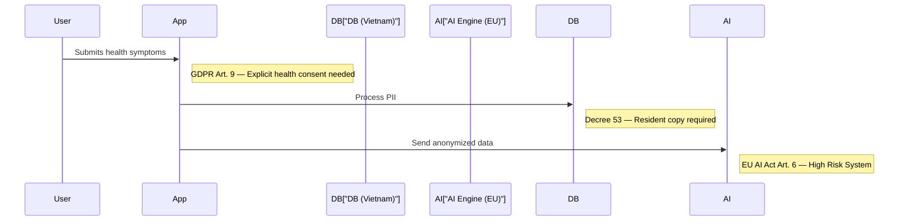

# Sample PRD Output — SafeAI-Global

> This is an example of the compliance section that SafeAI-Global generates when you ask it to write a PRD.

---

## Example Prompt

```text
"Write a PRD for a telemedicine app targeting Vietnam and EU markets with AI-powered diagnosis features."
```

## Example Output (v5.0.0)

### 🟡 SafeAI Badge: AA

### 🛡️ SafeAI-Global Score: 72/100

> **Posture: MODERATE RISK** — Requires supplementary controls for AI Governance and Localization.

---

### Executive Compliance Summary

| Field | Value |
|---|---|
| **Product** | TeleHealth AI — Telemedicine Platform |
| **Target Markets** | 🇻🇳 Vietnam, 🇪🇺 European Union |
| **Data Classification** | 🔴 HIGH SENSITIVITY — Health data (PHI/Special Category) |
| **AI Risk Level** | 🟠 HIGH RISK — EU AI Act (medical diagnosis AI) |

---

### Applicable Regulations

| Regulation | Region | Status | Source |
|---|---|---|---|
| GDPR (Art. 9 — Health Data) | 🇪🇺 EU | ✅ Addressed | <law_definition id="EU-GDPR"> |
| EU AI Act — High Risk (Art. 6) | 🇪🇺 EU | ⚠️ Pending | <law_definition id="EU-AI-ACT"> |
| VN Decree 13/2023 (PDPD) | 🇻🇳 Vietnam | ✅ Addressed | <law_definition id="VN-PDPD"> |
| VN Decree 53/2022 (Residency) | 🇻🇳 Vietnam | ⚠️ Pending | <law_definition id="VN-PDPD"> |
| ISO/IEC 27001 (InfoSec) | 🌐 Global | ✅ Mapped | <standards.md> |
| ISO/IEC 42001 (AI Management) | 🌐 Global | ✅ Mapped | <standards.md> |

---

### 🕵️ PII Detection Summary (Confirmation Required)

⚠️ **REQUIRED ACTIONS:**

- AES-256 encryption at rest
- TLS 1.3 for all transmissions
- Enable detailed audit logs for all PII access
- Store VN user data in Vietnam (Decree 53)
- Separate consent for EU health data (GDPR Art. 9)

---

### Actionable Compliance Checklist

- [x] Identify applicable jurisdictions (VN + EU)
- [x] Classify data sensitivity (HIGH — health data)
- [x] Map ISO 27001 Annex A controls
- [x] Document AI system per ISO 42001
- [x] File DPIA with Vietnam A05 (within 60 days)
- [x] Implement GDPR Art. 9 explicit consent for health data
- [x] Enable persistent audit logging and monitoring
- [ ] ⚠️ **Critical**: Set up Vietnam local data center (Decree 53/2022)
- [ ] ⚠️ **High**: Complete EU AI Act conformity assessment (Art. 43)
- [x] Implement accessibility (WCAG 2.2 Level AA)
- [x] Add legal disclaimer and data retention policies

---

### 📊 Compliance Visualizer (Mermaid)



---

> ⚠️ **Disclaimer:** This is AI-generated compliance guidance, not legal advice. Consult qualified legal counsel before deployment.

Generated by SafeAI-Global PRD Agent v5.0.0
